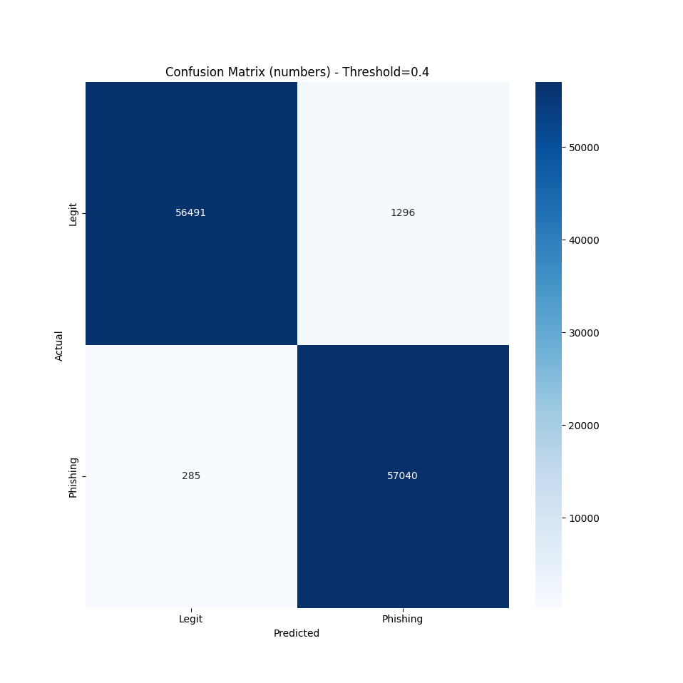

# AI Phishing Detector

A machine learning project for detecting phishing emails using TF-IDF and Logistic Regression.  
Built with Python, scikit-learn, and Flask, including a simple web interface and REST API.

---

## Overview
- Binary classification: phishing (1) vs legitimate (0)
- Trained on multiple combined datasets
- Focus on interpretability, error analysis, and production-style inference

---

## Model
- **Pipeline:** TF-IDF → Logistic Regression
- **Metrics:** High accuracy (~0.98–0.99); recall prioritized for phishing class
- **Threshold:** Custom decision threshold to reduce false negatives
- **Explainability:** Top contributing words extracted from model coefficients

---

## Visualizations

**Confusion matrix:**  


---

## Limitations & Observations
- Bag-of-words approach: no understanding of context or semantics
- Strong sensitivity to trigger words → false positives
- May miss phishing emails without obvious keywords (false negatives)
- Decision threshold directly affects recall/precision trade-off
- Probabilities can be overconfident due to linear model assumptions

---

## Usage

### Setup (Windows / Linux / macOS)
```bash
python -m venv venv
source venv/bin/activate  # or venv\Scripts\activate on Windows
pip install -r requirements.txt
```
- Run web  app & API
```bash
python app.py
```
#### API Example
```json
POST /predict
{"text": "Your account has been suspended. Click here."}

Response:
{"prediction": 1, "probability": 0.949}
```