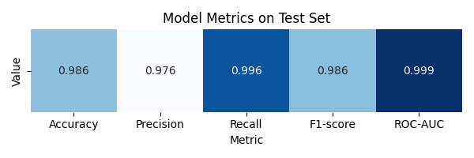
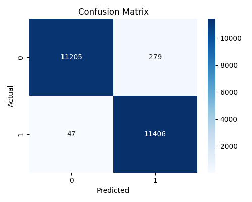
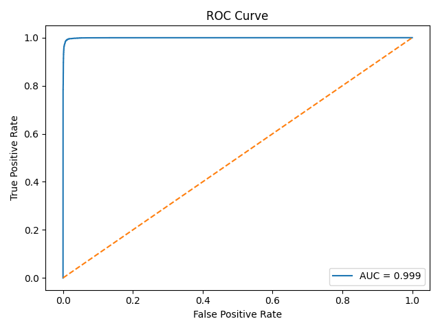
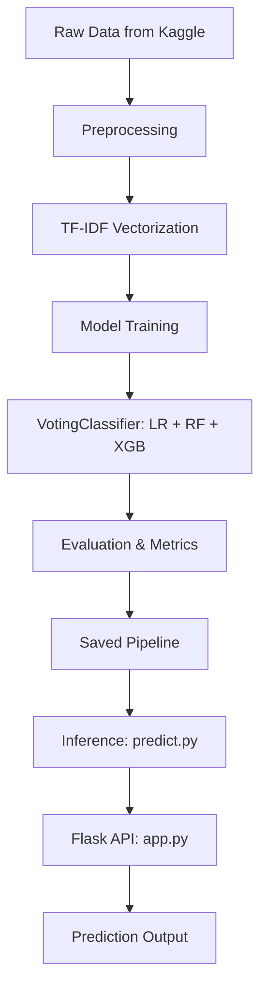

# AI Phishing Detector

## Project Overview

This project is a machine learning system for detecting phishing messages from text.
It implements a full pipeline including preprocessing, model training, evaluation, inference, and a Flask API.

The solution uses TF-IDF vectorization and an ensemble model (VotingClassifier) combining:

* Logistic Regression
* Random Forest
* XGBoost

The project structure and engineering decisions follow middle-level ML engineering best practices.

---

## Motivation

Phishing attacks remain one of the most common cybersecurity threats.
Automated detection systems can significantly reduce risk by identifying malicious messages before users interact with them.

---

## Dataset

* Source: Multiple phishing-related datasets collected from Kaggle and merged into a single dataset
* Total samples: ~114,000
* Class balance: ~50% phishing / ~50% legitimate

### Preprocessing steps

* Lowercasing
* URL removal
* Removal of non-alphabetic characters
* Whitespace normalization
* TF-IDF vectorization (uni-grams + bi-grams, max 5000 features)

NOTE:
Raw datasets are not included in this repository to keep it lightweight.
You can download similar datasets from Kaggle and merge them locally for training.

---

## Features & Preprocessing

Implemented in src/features.py:

* clean_text(text: str) -> str
* preprocess_texts(texts: List[str]) -> List[str]
* Input validation for inference
* Feature contribution extraction for explainability

TF-IDF vectorization is applied inside a unified Pipeline.

---

## Models

The final model is an ensemble using soft voting:

* Logistic Regression (interpretable baseline)
* Random Forest (non-linear patterns)
* XGBoost (gradient boosting)

The ensemble improves robustness and generalization while retaining interpretability via Logistic Regression.

---

## Experiments & Metrics

Visualizations:








---

## Project Architecture

Mermaid diagram (GitHub compatible):



---

## API Usage Example

* Model weights are not included. Train the model using train.py.

### 1. Create venv

```bash
python -m venv venv

```
#### Activate it
```bash
source venv/bin/activate # or venv\Scripts\activate on windows
```

### 2. Install dependencies
```bash
pip install -r requirements.txt
```

### 3. Prepare dataset
Download any phishing detection dataset from Kaggle
(e.g. phishing emails / SMS datasets).
Place the dataset file into the data/ directory.

#### ⚠️ Raw datasets are not included in this repository due to size and licensing constraints.

### 4. Train the model
```bash
cd src
python train.py
```
* Model will be saved into model/

### 5. Run Flask API
```bash
python app.py
```

### 6. Use web or send prediction request
```bash
curl -X POST [http://127.0.0.1:5000/predict](http://127.0.0.1:5000/predict) 
-H "Content-Type: application/json" 
-d '{"text": "Your account is blocked. Verify immediately."}'
```

Example response:
```json
{
"prediction": 1,
"label": "PHISHING",
"probability": 0.987,
"top_words": [["verify", 0.84], ["account", 0.63]]
}
```
---

## Directory Structure

ai-phishing-detector/

* data/        datasets (not included)
* images/      ROC curve and confusion matrix
* model/       saved pipeline
* src/

  * features.py   preprocessing and explainability
  * train.py      training and evaluation
  * predict.py    inference logic
* app.py       Flask API
* requirements.txt
* README.md
* CHANGELOG.md

---

## Limitations & Future Work

* Add SHAP-based explainability
* Extend to multiple languages
* Dockerize for deployment
* Automatic retraining pipeline
* Current pipeline relies on a pre-cleaned `cleaned_text` column in the dataset.
  Ideally, the dataset should only contain raw `text` and `label` columns,
  with all text preprocessing handled within the pipeline.
  This will be fixed in the final version to ensure consistency between
  training and inference.
---

## References

* [https://scikit-learn.org/](https://scikit-learn.org/)
* [https://xgboost.readthedocs.io/](https://xgboost.readthedocs.io/)
* [https://mermaid.js.org/](https://mermaid.js.org/)
