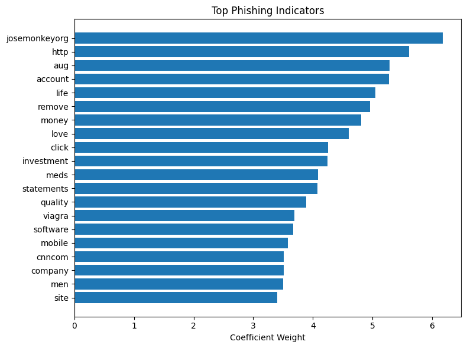

# AI Phishing Detector

A baseline machine learning model for detecting phishing emails using TF-IDF and Logistic Regression.  
Built with Python and scikit-learn.

---

## Dataset
- Emails labeled as phishing (1) or legitimate (0)
- Used for training and testing the model

---

## Model
- **Pipeline:** TF-IDF vectorization → Logistic Regression classifier
- **Performance:** ~0.98 accuracy on the test set (high, may indicate data leakage)
- **Explainability:** Top words influencing model predictions extracted from coefficients

---

## Top Words Analysis
The model reacts to trigger words often found in phishing emails. Examples include:
account, bank, payment, transaction

Red words increase the probability of phishing, green words decrease it.

### Visualization
A bar chart showing **word contribution** for a sample email:

---

## Error Analysis
- **False Positives (FP):** Legitimate emails with links or financial terms misclassified as phishing
- **False Negatives (FN):** Phishing emails without obvious trigger words missed
- **Reason:** Bag-of-words nature of TF-IDF; context is not considered

---

## Usage
1. Train or load the model via scikit-learn pipeline
2. Make predictions on new emails
3. Analyze top word contributions for explainable AI
