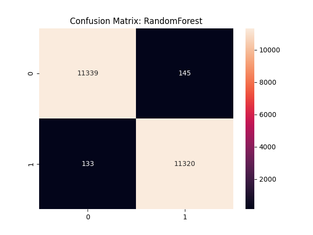
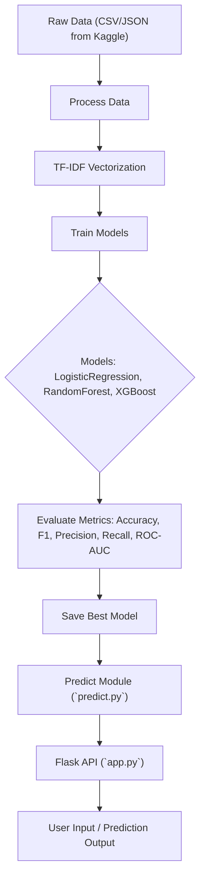

# AI Phishing Detector

## Project Overview

This project is a machine learning pipeline for detecting phishing messages from text. It uses TF-IDF vectorization and multiple models including Logistic Regression, Random Forest, and XGBoost (Gradient Boosting). The architecture separates **data preprocessing**, **training**, **inference**, and **API**, following best practices for middle-level ML projects.

## Motivation

Phishing attacks are a major cybersecurity threat. Automating detection helps reduce risk and improve security awareness.

## Dataset

* Source: **Collected from multiple Kaggle datasets and merged into a single dataset**
* Total samples: XXX
* Class balance: phishing / legit
* Preprocessing steps:

  * Lowercasing
  * Removal of URLs
  * Removal of non-alphabetic characters
  * TF-IDF vectorization (uni-grams + bi-grams, max 5000 features)

> ⚠️ **Note:** The repository does not include the raw data to keep it lightweight. You can download similar datasets from [Kaggle phishing datasets](https://www.kaggle.com/search?q=phishing+dataset) and merge them for training.

## Features

* Implemented in `src/features.py`
* Preprocessing functions:

  * `clean_text(text: str) -> str`
  * `preprocess_texts(texts: List[str]) -> List[str]`
* TF-IDF vectorizer produces feature matrix for all models

## Models Implemented

* Logistic Regression (baseline)
* Random Forest
* XGBoost (Gradient Boosting)

## Experiments & Metrics

| Model              | Accuracy | F1-score | Precision | Recall |
| ------------------ | -------- | -------- | --------- | ------ |
| LogisticRegression | 0.980    | 0.980    | 0.976     | 0.984  |
| RandomForest       | 0.988    | 0.988    | 0.987     | 0.988  |
| XGBoost            | 0.984    | 0.984    | 0.977     | 0.990  |

* Cross-validation F1-score: 0.986
* ROC-AUC: 0.999
* Confusion matrix


--


## Project Architecture



**Explanation:**

* Data flows from Kaggle datasets (merged) to preprocessing
* TF-IDF converts text into feature vectors
* Models are trained, evaluated, and the best model is saved
* `predict.py` handles inference
* `app.py` exposes a thin Flask API
* Users can send requests and get predictions with confidence scores

## Usage / API Example

```bash
curl -X POST http://127.0.0.1:5000/predict -H "Content-Type: application/json" -d '{"text":"Your account is blocked, verify it"}'
```

Response:

```json
{
  "label": "phishing",
  "confidence": 0.987
}
```

## Directory Structure

```
ai-phishing-detector/
├── data/               # raw and processed datasets (not included)
├── images/             # visualizations (confusion matrix, ROC)
├── model/              # saved models (.pkl / .joblib)
├── src/
│   ├── features.py     # preprocessing functions
│   ├── models.py       # model definitions
│   ├── train.py        # training scripts
│   └── predict.py      # inference functions
├── app.py              # Flask API
├── requirements.txt
├── README.md
└── CHANGELOG.md
```

## Limitations & Future Work

* Ensemble between RF and XGBoost could improve performance
* Extend to multiple languages
* Automatic dataset updates
* Adding more metrics visualization (precision-recall curves, feature importance)

## References

* [Keep a Changelog](https://keepachangelog.com/en/1.0.0/)
* [Mermaid.js for diagrams](https://mermaid.js.org/)
