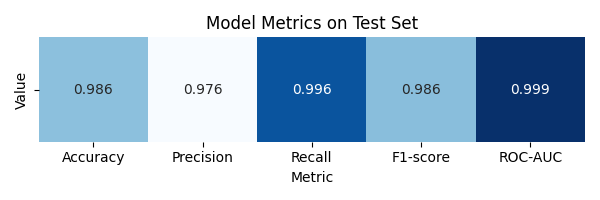
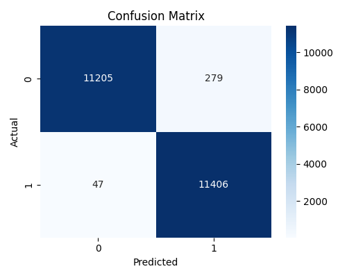
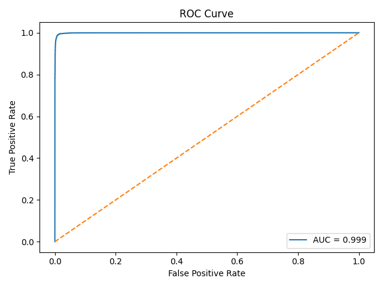
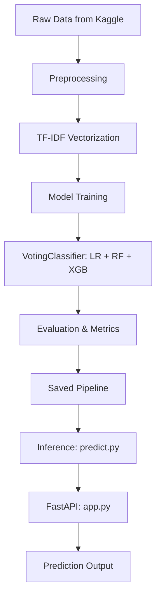

# AI Phishing Detector

[](https://github.com/cont1n3nt/ai-phishing-detector/actions/workflows/ci.yml)
[](https://www.python.org/)
[](https://opensource.org/licenses/MIT)
[](https://github.com/astral-sh/ruff)
[](https://docs.pytest.org/)

## Project Overview

This project is a machine learning system for detecting phishing messages from text.
It implements a full pipeline including preprocessing, model training, evaluation, inference, and a FastAPI.

The solution uses TF-IDF vectorization and an ensemble model (VotingClassifier) combining:

* Logistic Regression
* Random Forest
* XGBoost

---

## CI/CD

Automated pipeline runs on every push and pull request to `main`/`master`:

```
checkout → setup Python 3.11 → install deps → run unit tests (pytest)
```

[](https://github.com/cont1n3nt/ai-phishing-detector/actions/workflows/ci.yml)

---

## Installation

### Prerequisites

* Python 3.11+
* pip

### Setup

```bash
# 1. Clone the repository
git clone https://github.com/cont1n3nt/ai-phishing-detector.git
cd ai-phishing-detector

# 2. Create and activate a virtual environment
python -m venv .venv
# Windows
.venv\Scripts\activate
# Linux / macOS
# source .venv/bin/activate

# 3. Install dependencies
pip install -r requirements.txt
```

### Run with pretrained model

Downloads the model from HuggingFace Hub, then starts the API server:

```bash
python scripts/download_model.py
python app.py
```

### Train from scratch

Requires the dataset to be present at `data/preprocess/cleaned_dataset.csv`:

```bash
python -m src.train
```

### Run with Docker

```bash
docker build -t ai-phishing-detector .
docker run -p 8000:8000 ai-phishing-detector
```

### Run tests

```bash
pytest
# or a specific subset
pytest tests/test_features.py tests/test_api.py -v
```

---

## Configuration

Create a `.env` file in the project root to override defaults:

```env
THRESHOLD=0.4
MAX_FEATURES=5000
HF_MODEL_REPO=cont1n3nt/ai-phishing-model
HF_DATASET_REPO=cont1n3nt/ai-phishing-dataset
```

---

## Motivation

Phishing attacks remain one of the most common cybersecurity threats.
Automated detection systems can significantly reduce risk by identifying malicious messages before users interact with them.

---

## Dataset

* Source: Multiple phishing-related datasets collected from Kaggle and merged into a single dataset
* Total samples: ~114,000
* Class balance: ~50% phishing / ~50% legitimate
* [HuggingFace Dataset](https://huggingface.co/datasets/cont1n3nt/ai-phishing-dataset)

### Preprocessing steps

* Lowercasing
* URL removal
* Removal of non-alphabetic characters
* Whitespace normalization
* TF-IDF vectorization (uni-grams + bi-grams, max 5000 features)

NOTE:
Raw datasets are not included in this repository to keep it lightweight.

---

## Features & Preprocessing

Implemented in `src/features.py`:

* `clean_text(text: str) -> str`
* `preprocess_texts(texts: List[str]) -> List[str]`
* Input validation for inference
* Feature contribution extraction for explainability

TF-IDF vectorization is applied inside a unified Pipeline.

---

## Models

The final model is an ensemble using soft voting:

* Logistic Regression (interpretable baseline)
* Random Forest (non-linear patterns)
* XGBoost (gradient boosting)

The ensemble improves robustness and generalization while retaining interpretability via Logistic Regression.

[HuggingFace Model](https://huggingface.co/cont1n3nt/ai-phishing-model)

---

## Model Management

The trained pipeline is versioned and distributed through HuggingFace Hub.

Artifacts include:

- TF-IDF vocabulary
- preprocessing pipeline
- ensemble weights
- metadata/configuration

Use `python scripts/download_model.py` to fetch the latest version.

---

## Experiments & Metrics

Visualizations:








---

## Project Architecture

Mermaid diagram (GitHub compatible):


```mermaid
graph TD
    A[Raw Data from Kaggle] --> B[Preprocessing]
    B --> C[TF-IDF Vectorization]
    C --> D[Model Training]
    D --> E[VotingClassifier: LR + RF + XGB]
    E --> F[Evaluation & Metrics]
    F --> G[Saved Pipeline]
    G --> H[Inference: predict.py]
    H --> I[FastAPI: app.py]
    I --> J[Prediction Output]
```

---

## API Usage

### Run FastAPI

```bash
python app.py
```

### Send prediction request

```bash
curl -X POST http://127.0.0.1:8000/predict \
  -H "Content-Type: application/json" \
  -d '{"text": "Your account is blocked. Verify immediately."}'
```

Example response:

```json
{
  "prediction": 1,
  "label": "PHISHING",
  "probability": 0.987,
  "top_words": [["verify", 0.84], ["account", 0.63]]
}
```

---

## Directory Structure

```
ai-phishing-detector/
├── app.py              FastAPI application
├── config.py           Configuration
├── requirements.txt    Dependencies
├── Dockerfile          Docker image
├── data/               datasets (not included)
├── images/             ROC curve and confusion matrix
├── model/              saved pipeline (auto-downloaded)
├── scripts/
│   └── download_model.py
├── src/
│   ├── features.py    preprocessing and explainability
│   ├── train.py       training and evaluation
│   └── predict.py     inference logic
└── tests/              unit tests
```

---

## Contributing

1. Fork the repository
2. Create a feature branch: `git checkout -b feat/my-feature`
3. Make your changes and add tests
4. Run the test suite: `pytest`
5. Open a pull request

---

## Limitations & Future Work

* Add SHAP-based explainability
* Extend to multiple languages
* Automatic retraining pipeline

---

## References

* [scikit-learn](https://scikit-learn.org/)
* [XGBoost](https://xgboost.readthedocs.io/)
* [FastAPI](https://fastapi.tiangolo.com/)
